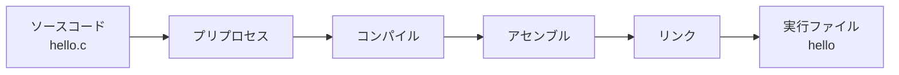

# C言語の基礎

この章では、C言語のプログラムが「文字の並び」から「動くもの」になるまでの流れと、どんなプログラムにも共通する基本部品（変数、式、制御構造、関数）を一通り押さえます。すでにCを少しかじったことがある人にとっては復習になりますが、後の章で使う言葉をそろえる意味でも目を通してください。

## ソースコードから実行ファイルまで

Cのプログラムは、人間が読める**ソースコード**として書かれます。これはそのままでは動きません。コンピュータが実行できるのは、CPUが直接理解する**機械語（machine code）**だけだからです。ソースコードを機械語に翻訳する道具が**コンパイラ**です。

実は、`cc hello.c -o hello` という一つのコマンドの裏で、いくつかの段階が順に実行されています。



- **プリプロセス（preprocess）**：`#include` や `#define` といった、`#` で始まる命令を処理します。`#include <stdio.h>` は「`stdio.h` というファイルの中身をここに貼り付けよ」という意味で、`printf` などの機能を使えるようにします。`#define` で定義する**マクロ（macro）**は、コンパイル前にテキストを置き換える仕組みです。
- **コンパイル（compile）**：プリプロセス済みのCコードを、CPUごとの**アセンブリ言語**に翻訳します。
- **アセンブル（assemble）**：アセンブリ言語を機械語に翻訳し、**オブジェクトファイル**を作ります。
- **リンク（link）**：複数のオブジェクトファイルや、`printf` のような既製の部品（**ライブラリ**）をつなぎ合わせ、一つの実行ファイルにまとめます。

ふだんは一つのコマンドにまとまっているので意識する必要はありませんが、「ヘッダファイルを include し忘れた」「関数の定義が見つからない（リンクエラー）」といった失敗の原因を理解するには、この段階分けを知っておくと役に立ちます。各段階の詳細は[](#cite:kernighan1988)の付録や[](#cite:seacord2020)で丁寧に解説されています。

> [!NOTE]
> C言語には**規格（standard）**があります。「C99」「C11」「C17」などはその版を表す呼び名で、最新のものの一つがC17[](#cite:iso2018)です。規格はコンパイラごとの方言を防ぎ、「正しいCプログラムとは何か」を定めています。コンパイル時に `cc -std=c17 hello.c` のように版を指定できます。

## main関数とプログラムの入り口

すべてのCプログラムは、`main` という名前の関数から実行が始まります。

```c
#include <stdio.h>

int main(void) {
    printf("計算を始めます\n");
    return 0;
}
```

`int main(void)` を分解してみましょう。先頭の `int` は、この関数が**整数（integer）**を返すことを示します。`main` が返す整数は**終了コード**と呼ばれ、`0` は「正常終了」を、それ以外は「何らかの異常」を意味する慣習です。括弧の中の `void`（ボイド、「空」の意）は「引数を受け取らない」という意味です。`{` から `}` までが関数の中身で、上から順に実行されます。`return 0;` でこの値を呼び出し元（OS）に返してプログラムは終わります。

`printf` は文字列を画面に表示する関数です。末尾の `\n` は**改行**を表す特殊な書き方で、これがないと次の出力と同じ行にくっついてしまいます。

## 変数とデータ型

**変数（variable）**は、値に名前を付けて覚えておく入れ物です。Cでは、変数を使う前にその**型（type）**を宣言しなければなりません。型とは「その入れ物に何を入れるか」を表すもので、たとえば整数なら `int`、小数なら `double` です。

```c
int count = 0;        // 整数の変数 count を 0 で初期化
double pi = 3.14159;  // 小数の変数 pi
char grade = 'A';     // 1文字を表す変数（'A' は文字定数）
```

`//` から行末まではコメントで、コンパイラに無視されます。複数行のコメントは `/* ... */` でも書けます。

変数に最初の値を与えることを**初期化（initialization）**と呼びます。初期化していない変数の中身は不定（何が入っているかわからない）で、これはバグの温床です。宣言と同時に初期化する習慣をつけましょう。型については次章[](types.md)でさらに詳しく扱います。

> [!WARNING]
> 初期化していない変数を読むのは、Cでよくある間違いの一つです。`int x;` とだけ書いて値を入れる前に `x` を使うと、ゴミの値が読まれて結果が不定になります。コンパイラの警告を有効にする `-Wall` オプション（`cc -Wall ...`）を付けると、こうした危険を多く知らせてくれます。

## 式と演算子

**式（expression）**は、計算して値を生み出す断片です。`1 + 2` も `count * 3` も式です。Cの主な算術演算子は次のとおりです。

| 演算子 | 意味 | 例 | 結果 |
|--------|------|----|------|
| `+` | 加算 | `3 + 4` | `7` |
| `-` | 減算 | `10 - 6` | `4` |
| `*` | 乗算 | `3 * 4` | `12` |
| `/` | 除算 | `7 / 2` | `3`（整数同士なら切り捨て） |
| `%` | 剰余（余り） | `7 % 2` | `1` |

注意したいのは `/` です。整数同士の割り算は**小数点以下が切り捨て**られ、`7 / 2` は `3` になります。`3.5` がほしければ `7.0 / 2` のように、どちらかを小数にする必要があります。この「型によって演算の意味が変わる」性質は、言語処理系で割り算を実装するときに必ず向き合う問題です。

比較演算子（`==` 等しい、`!=` 等しくない、`<`、`>`、`<=`、`>=`）は、条件が成り立てば `1`、成り立たなければ `0` という値を返します。Cには本来「真偽」専用の型がなく、**0を偽、0以外を真**として扱う点を覚えておいてください。

> [!CAUTION]
> 「等しい」を表す `==` と、代入の `=` を取り違える間違いはよく起こります。`if (x = 0)` と書くと、`x` に `0` を代入したうえでその結果（`0`＝偽）で条件判定してしまい、意図と違う動きになります。比較のつもりなら必ず `==` を使ってください。

## 条件分岐とくり返し

プログラムを「上から順に実行する」だけでなく、条件によって枝分かれさせたり、くり返したりするのが**制御構造（control flow）**です。

条件分岐は `if` と `else` で書きます。

```c
if (n % 2 == 0) {
    printf("偶数です\n");
} else {
    printf("奇数です\n");
}
```

くり返しは `while` や `for` を使います。次は1から10までの合計を求める例です。

```c
int sum = 0;
for (int i = 1; i <= 10; i++) {
    sum += i;   // sum = sum + i と同じ
}
printf("合計は %d です\n", sum);
```

`for (初期化; 継続条件; 更新)` の三つの部分を見てみましょう。まず `int i = 1` でカウンタを用意し、`i <= 10` が成り立つ間くり返し、各回の最後に `i++`（`i` を1増やす）を実行します。`sum += i` は `sum = sum + i` の短い書き方です。`printf` の中の `%d` は「ここに整数を10進数で埋め込め」という指示で、後ろの `sum` の値に置き換わります。

くり返しは言語処理系にとって特別に重要です。なぜなら、インタプリタの本体は「次の命令を取り出して実行する」ことの巨大なくり返しだからです。このループの効率が処理系全体の速度を左右します（[](optimization-advanced.md)で詳しく扱います）。

## 関数

**関数（function）**は、ひとまとまりの処理に名前を付けて、何度でも呼び出せるようにする仕組みです。`main` も関数の一つでした。自分で関数を定義してみましょう。

```c
#include <stdio.h>

// 二つの整数を受け取り、大きいほうを返す関数
int max(int a, int b) {
    if (a > b) {
        return a;
    } else {
        return b;
    }
}

int main(void) {
    int result = max(3, 8);
    printf("大きいほうは %d\n", result);  // 8 と表示される
    return 0;
}
```

`int max(int a, int b)` の読み方は、`main` のときと同じです。返り値の型が `int`、名前が `max`、そして括弧の中の `int a, int b` が**引数（argument）**、つまり呼び出し時に渡される値の受け皿です。`max(3, 8)` と呼ぶと、`a` に `3`、`b` に `8` が入り、`return` で返された値が `result` に代入されます。

関数を使うと、複雑な処理を小さな部品に分けて考えられます。言語処理系のような大きなプログラムでは、「字句解析をする関数」「構文解析をする関数」「式を評価する関数」のように役割ごとに関数を分けるのが定石です。良い関数分割は、プログラムを読みやすく、直しやすくします[](#cite:kernighan1988)。

> [!IMPORTANT]
> 関数は呼び出される前に、コンパイラがその存在を知っている必要があります。上の例では `max` を `main` より前に定義しているので問題ありません。順序を入れ替えたいときは、関数の中身を書かずに型だけを宣言する**プロトタイプ宣言**（`int max(int a, int b);`）をファイルの先頭に置きます。これは関数を別ファイル（ヘッダファイル）にまとめるときの基本でもあります。

## この章のまとめ

- Cのソースコードは、プリプロセス・コンパイル・アセンブル・リンクを経て実行ファイルになる。
- プログラムは `main` 関数から始まる。
- 変数は型を持ち、使う前に宣言・初期化する。
- 式は値を生み、`/` は整数だと切り捨てになるなど型に注意がいる。
- `if`／`for`／`while` で処理の流れを制御する。
- 処理は関数に分けて名前を付ける。

次章では、この「型」という考え方をさらに詳しく扱います。
