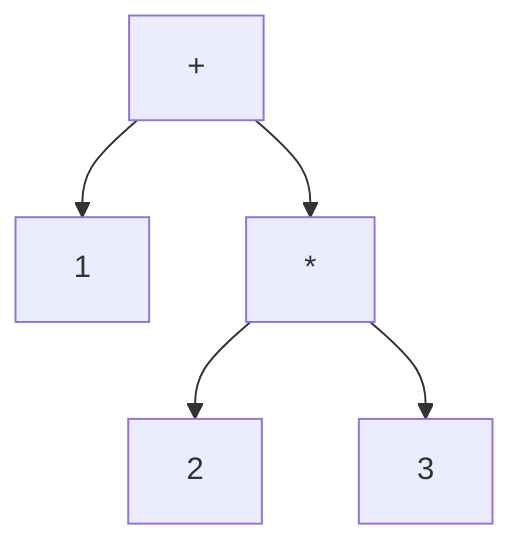

# なぜ言語処理系にC言語なのか

この章では、本書全体の地図を描きます。そもそも「言語処理系」とは何か、なぜその実装にC言語がよく使われるのか、そして本書をどう読み進めればよいのかを説明します。手を動かすための開発環境の準備にも触れます。

## 言語処理系とは何か

**言語処理系（language processor）**とは、プログラミング言語で書かれたソースコードを受け取り、それを実行したり、別の形式に変換したりするソフトウェアの総称です。代表的なものに次の二種類があります。

- **インタプリタ（interpreter）**：ソースコードを読みながら、その場で意味を解釈して実行する処理系。Rubyの標準実装やPythonの標準実装CPythonがこの方式です。
- **コンパイラ（compiler）**：ソースコードを、機械語や別の言語など、より低レベルな形式へ一括変換する処理系。CコンパイラのGCCやClangがこれにあたります。

どちらも内部では似た段階を踏みます。文字の並びを意味のある単位（**トークン**, token）に区切る**字句解析（lexical analysis）**、トークンの並びから文法構造を組み立てる**構文解析（parsing）**、そして組み立てた構造を実行または変換する段階です。構文解析の結果は普通、木構造の形にまとめられ、これを**抽象構文木（abstract syntax tree, AST）**と呼びます。たとえば `1 + 2 * 3` という式は、次のような木になります。



掛け算が足し算より深い位置にあるのは、掛け算が先に計算されるからです。この木を根からたどって計算すれば `1 + 6 = 7` が得られます。本書の後半では、まさにこの「木を作って、たどって、計算する」処理をC言語で書けるようになることを目指します。言語処理系の全体像をより深く学びたい場合は、定番の教科書であるドラゴンブック[](#cite:aho2006)や、手を動かしながら学べる[Crafting Interpreters](#cite:nystrom2021)が良い道案内になります。

> [!NOTE]
> 本書は「C言語の入門書」であって「言語処理系の作り方の本」ではありません。言語処理系づくりは、Cの機能がなぜ必要になるかを示すための**題材**として使います。木の作り方そのもの（構文解析アルゴリズムなど）は深追いせず、Cの道具立てに集中します。

## なぜC言語なのか

世の中には便利な言語がたくさんあるのに、なぜいまさらCを学ぶのでしょうか。言語処理系という文脈では、いくつもの理由があります。

第一に、実物がCで書かれていることです。前述のCPythonやLua、Rubyの処理系MRIなど、広く使われている言語処理系の心臓部はCで書かれています。それらのソースコードを読んだり改造したりしたいなら、Cが読めることは大きな武器になります。

第二に、メモリの仕組みが見えることです。言語処理系は、値やASTといったデータを大量に作っては捨てます。どこにメモリが確保され、いつ解放されるのかを意識できることは、効率的な処理系を書くうえで欠かせません。Cはメモリを隠さない言語なので、この感覚が自然に身につきます。

第三に、速いことです。インタプリタの内側のループは、プログラムの実行中に何百万回も回ります。ここが遅いと処理系全体が遅くなります。Cは機械語に近い制御ができるため、速い処理系を書きやすいのです。インタプリタの速さがどこから来るのかは、Ertlらの研究[](#cite:ertl2003)でも詳しく分析されています。

> [!TIP]
> 「速い言語」が常に正解というわけではありません。試作の段階ではPythonやRubyのような書きやすい言語で書き、性能が問題になったところだけをCで書き直す、という進め方も現実的です。本書はあくまで「Cという選択肢を取れるようになる」ことを目指します。

## 本書の進め方

本書は三部構成です。第I部でCの基礎（コンパイルの流れ、型、ポインタ）を固め、第II部でデータを表現する道具（構造体、共用体、関数ポインタ、`const`、メモリ管理）を学び、第III部で処理系を速くする最適化を扱います。

各章は前の章を前提に進みます。とくにポインタ（[](pointers.md)）は後のほとんどの章で使うので、飛ばさずに読んでください。巻末には用語集（[](glossary.md)）と、さらに学ぶための文献案内（[](further-reading.md)）を用意しました。知らない言葉が出てきたら用語集を引いてください。

## 開発環境を用意する

C言語のプログラムを動かすには、コンパイラが必要です。代表的なものにGCCとClangがあります。多くのLinux環境やmacOSでは、どちらかが最初から入っているか、簡単に導入できます。

コンパイラが入っているかは、ターミナル（端末）で次のように打って確かめられます。

```bash
cc --version
```

`cc` は「Cコンパイラ」を指す慣習的な名前で、GCCやClangへの別名になっていることが多いです。バージョン情報が表示されれば準備完了です。表示されない場合は、Linuxなら `build-essential`（GCC一式）パッケージを、macOSなら「Command Line Tools」を導入してください。

簡単なプログラムをコンパイルして実行する流れは次のようになります。`hello.c` というファイルに書いて、

```c
#include <stdio.h>

int main(void) {
    printf("こんにちは、言語処理系\n");
    return 0;
}
```

次のコマンドでコンパイルし、できた実行ファイルを動かします。

```bash
cc hello.c -o hello
./hello
```

`-o hello` は「`hello` という名前の実行ファイルを作れ」という指示です。`./hello` で実行すると、メッセージが表示されます。各行が何をしているのかは次の章で詳しく説明するので、いまは「こうやって動かすのだ」という流れだけつかめれば十分です。

> [!IMPORTANT]
> 本書を読むうえで一番効果的なのは、**サンプルコードを実際にコンパイルして動かしてみる**ことです。エラーメッセージに出会い、それを直す経験こそがC言語の習得を早めます。読むだけでなく、ぜひ手を動かしてください。
