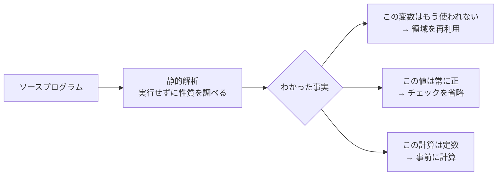

# コンパイラの中身と処理系を速くする技法

前章では「まず計測、それからコンパイラに任せる」という心構えを学びました。この章では一歩進んで、コンパイラが内部で何をやっているのかを代表的な変換を通してのぞき、さらに言語処理系そのものを速くするための技法に踏み込みます。前章の基礎を踏まえたうえで読んでください。

## コンパイラが行う代表的な最適化

`-O2` を付けたとき、コンパイラはソースコードの「意味」を変えずに、機械語を速くする変換を多数適用します。代表的なものをいくつか、具体例で見ていきます。これらを知っておくと、「自分で書くべきこと」と「コンパイラに任せてよいこと」の線引きができるようになります。

**定数畳み込み（constant folding）**は、コンパイル時に計算できる式を、あらかじめ計算してしまう変換です。

```c
int x = 60 * 60 * 24;   // 書いた人は意味（1日の秒数）を明示したい
// コンパイラは 86400 を直接埋め込む。実行時の掛け算は消える
```

`60 * 60 * 24` は実行するまでもなく `86400` だとわかります。コンパイラはこれを計算済みの値に置き換えるので、わざわざ自分で `86400` と書いて意味をわかりにくくする必要はありません。**意味の伝わる書き方をして、計算はコンパイラに任せる**。これが定数畳み込みの教訓です。

**共通部分式の除去（common subexpression elimination）**は、同じ計算が何度も現れるとき、一度だけ計算して使い回す変換です。

```c
// 書いたコード
int a = (x + y) * 2;
int b = (x + y) * 3;
// コンパイラは (x + y) を一度だけ計算し、両方で使い回す
```

**関数のインライン展開（inlining）**は、小さな関数の呼び出しを、その中身で置き換える変換です。関数呼び出しには、引数を渡したり戻り先を覚えたりする手間（オーバーヘッド）がかかります。中身が数行の関数なら、呼び出すより本体を直接埋め込んだほうが速いことがあります。`eval` から呼ばれる小さなヘルパ関数などは、コンパイラがインライン展開してくれることが多いのです。

ここに挙げたのは一部にすぎず、前章で触れたループ不変式の移動や、ループの展開、レジスタ割り当てなど、コンパイラは何十種類もの最適化を組み合わせます。その全体像はコンパイラの専門書[](#cite:muchnick1997)やドラゴンブック[](#cite:aho2006)で体系的に学べます。**これらの大半は人間が手で書く必要がありません**。コンパイラに任せ、人間は読みやすさとアルゴリズムに集中する。これが賢い分業です。

> [!NOTE]
> 自分のコードがどう最適化されたか気になるなら、コンパイラが吐くアセンブリを見られます（`cc -O2 -S interp.c` で `interp.s` が生成されます）。あるいは [Compiler Explorer](https://godbolt.org/) というウェブツールを使うと、ソースと生成コードを並べて見られます。「この書き方とあの書き方で、生成コードは同じだった」とわかれば、見やすいほうを安心して選べます。

## インタプリタのディスパッチを速くする

ここからは、言語処理系に特有の最適化です。前章で「インタプリタの内側ループが速度を決める」と述べました。その内側ループの中心にあるのが、**ディスパッチ（dispatch）**、すなわち「次に実行すべき命令を選んで、その処理に飛ぶ」操作です。バイトコードインタプリタ（構文木ではなく、命令の列を順に実行する方式）を例に考えます。

もっとも素直な書き方は、大きな `switch` 文でループを回すものです。

```c
// 命令の列 code を先頭から実行する（簡略版）
for (;;) {
    uint8_t op = *ip++;        // 次の命令を取り出し、ポインタを進める
    switch (op) {
        case OP_ADD:  /* 加算の処理 */  break;
        case OP_SUB:  /* 減算の処理 */  break;
        case OP_PUSH: /* 値を積む処理 */ break;
        /* ... 命令の数だけ case が並ぶ ... */
    }
}
```

これは正しく動きますし、出発点として申し分ありません。しかし命令を1個実行するたびに、ループの先頭へ戻り、`switch` の分岐判定をやり直します。この「ループ末尾から先頭への戻り」と「`switch` の分岐」が、CPUにとっては予測しづらく、性能の足かせになることが知られています。CPUは次に進む先を先読み（**分岐予測 / branch prediction**）して高速に動きますが、`switch` ディスパッチはこの先読みを外しやすいのです。

これを改善する古典的な技法が、[](function-pointers.md)で触れた**スレッデッドコード（threaded code）**です[](#cite:bell1973)。アイデアは、「各命令の処理の末尾で、`switch` に戻らず、**次の命令の処理へ直接ジャンプする**」というものです。

```c
// computed goto を使ったスレッデッドコード（GCC/Clang の拡張機能）
static void *table[] = { &&do_add, &&do_sub, &&do_push, /* ... */ };
#define DISPATCH() goto *table[*ip++]   // 次の命令へ直接飛ぶ

DISPATCH();                 // 最初の命令へ
do_add:  /* 加算の処理 */  DISPATCH();   // 処理の最後で、次の命令へ直接ジャンプ
do_sub:  /* 減算の処理 */  DISPATCH();
do_push: /* 値を積む処理 */ DISPATCH();
```

各命令の処理の末尾にディスパッチを置くことで、命令ごとに別々のジャンプ地点ができ、CPUの分岐予測が当たりやすくなります。Ertlらの研究[](#cite:ertl2003)は、こうした技法がインタプリタの性能をどれだけ左右するかを詳しく分析しており、ディスパッチの設計がインタプリタ速度の中心的な要因であることを示しています。`goto *` という見慣れない記法はGCC/Clangの拡張機能で標準Cではありませんが、高速なインタプリタの実装では広く使われています[](#cite:nystrom2021)。

> [!IMPORTANT]
> ここでも前章の原則が効きます。スレッデッドコードはコードを複雑にします。まず素直な `switch` 版を作って正しく動かし、プロファイラでディスパッチが本当にボトルネックだと**確認してから**、この技法を導入すべきです。確認せずに最初からこう書くのは、まさにクヌースの戒める「早すぎる最適化」[](#cite:knuth1974)です。

## 静的解析で実行前に手を打つ

もう一つの発展的な方向が、**静的解析（static analysis）**、すなわちプログラムを実行する前に、その性質を調べて最適化に活かす技法です。前章で見たコンパイラの最適化も、その多くは静的解析に支えられています。

たとえば「この変数の値は、ここから先で二度と使われない」とわかれば、その変数を保持するためのメモリやレジスタを別の用途に回せます（**生存解析 / liveness analysis**）。あるいは「この計算結果は、どこに行っても必ず正の数だ」とわかれば、負数のチェックを省けます。こうした「実行しなくてもわかる事実」を集めて、無駄を削るわけです。

静的解析の理論的な土台として有名なのが、**抽象解釈（abstract interpretation）**です。これは、プログラムを「実際の値」ではなく「値の性質（符号、範囲、型など）」のレベルで「実行」してみることで、起こりうる挙動を安全に見積もる枠組みです。1977年にクザンらが定式化しました[](#cite:cousot1977)。たとえば「変数 `x` は常に 0 以上 100 以下だ」とわかれば、配列の範囲チェックを省ける、といった最適化につながります。



言語処理系を作る側にとって、静的解析は「自分の処理系を賢くする」ための道具です。最初は何もせず素直に実行する処理系で十分ですが、性能を追い求める段階になると、こうした解析が効いてきます。理論はやや高度ですが、ドラゴンブック[](#cite:aho2006)やコンパイラ実装の教科書[](#cite:appel1998)が橋渡しをしてくれます。

> [!TIP]
> 静的解析は最適化のためだけのものではありません。「使われていない変数」「ヌルになりうるポインタの間接参照」「`free` 済みメモリの使用」といった**バグの検出**にも使われます。コンパイラの `-Wall -Wextra` 警告や、`clang --analyze` のような静的解析ツールは、まさにこの技術の応用です。本書が一貫して勧めてきた「警告を消す」習慣は、静的解析の恩恵を受け取る行為でもあったのです。

## 最適化をどこで止めるか

最適化には終わりがありません。やろうと思えばいくらでも手を入れられます。だからこそ、**どこで止めるか**を決めることが大切です。

判断の基準は二つあります。ひとつは**目標**です。「このプログラムが1秒以内に終わればよい」という目標があるなら、それを達成した時点で最適化は終わりです。目標がないまま「もっと速く」を追うと、労力に見合わない細かな改善に延々と時間を溶かすことになります。

もうひとつは**費用対効果**です。最適化はたいていコードを複雑にし、読みにくく、直しにくくします。得られる速度向上が、その複雑さに見合うかを天秤にかけます。前章で見たように、効果は「何度も実行される場所」に集中するので、**ホットスポット**（実行時間の大半を占めるごく一部）だけを最適化し、残りは読みやすさを優先するのが王道です。これはクヌースの論文[](#cite:knuth1974)が半世紀前に説いたことそのものであり、いまも変わらない最適化の知恵です。

> [!CAUTION]
> 最適化のためにコードを書き換えたら、**必ず前後で計測し、結果が変わっていないことも確認**してください。速くなったつもりが遅くなっていた、あるいは速くなったが計算結果が壊れていた。どちらも起こりえます。速度の計測（前章のタイマー）と、正しさの確認（テスト）は、最適化と必ずセットにします。

## この章のまとめ

- コンパイラは定数畳み込み、共通部分式の除去、インライン展開など多くの最適化を自動で行う。人間はその大半を手書きしなくてよい。
- インタプリタの速度はディスパッチが左右する。`switch` 方式をスレッデッドコードに変える古典的技法がある。
- 静的解析（抽象解釈など）は、実行前にプログラムの性質を調べ、最適化やバグ検出に活かす。
- 最適化には目標と費用対効果という止めどきがある。ホットスポットに集中し、計測と正しさの確認を必ずセットにする。

これで本書の本編は終わりです。型からポインタ、構造体や共用体や関数ポインタ、メモリ管理、そして最適化まで、簡単な言語処理系を作るのに必要なC言語の道具がそろいました。巻末の用語集（[](glossary.md)）と文献案内（[](further-reading.md)）も活用し、ぜひ自分の手で処理系を育ててみてください。
