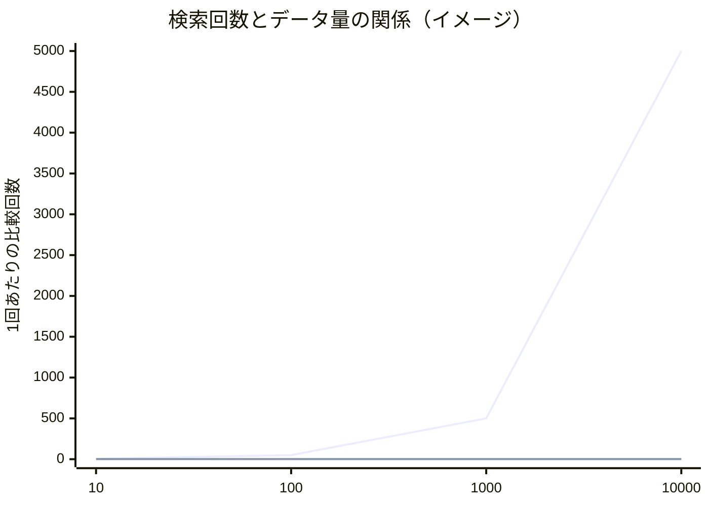

# 最適化の基礎：まず計測、それから手を入れる

ここまでで、小さな言語処理系を組み立てる道具がそろいました。動くものができたら、次に気になるのが「速さ」です。インタプリタが遅ければ、その上で動くすべてのプログラムが遅くなります。しかし最適化は、やみくもに手を出すと、コードを複雑にするばかりで速くもならない——という罠が多い分野です。この章では、最適化に向き合う前の心構えと、土台となる基礎を学びます。

## 早すぎる最適化は諸悪の根源

最適化の話は、ある有名な戒めから始めるのが筋です。ドナルド・クヌースは1974年の論文で、こう書きました——「**早すぎる最適化は諸悪の根源である（premature optimization is the root of all evil）**」[](#cite:knuth1974)。

これは「最適化するな」という意味ではありません。クヌースが言いたかったのは、**プログラムのどこが本当に遅いのかを確かめないまま、勘で細かい高速化に走るな**ということです。経験則として、プログラムの実行時間の大半は、コード全体のごく一部に集中します。残りの大部分をいくら磨いても、全体の速度はほとんど変わりません。それどころか、読みにくく直しにくいコードが残るだけです。

だから最適化の第一歩は、コードを書き換えることではありません。**どこが遅いのかを知ること**です。

> [!IMPORTANT]
> 最適化に取りかかる前に、自問してください。「ここは本当に遅いのか？　それを何で確かめたのか？」。確かめずに「ここが遅そうだ」という勘だけで手を入れるのが、クヌースの戒める「早すぎる最適化」です。まず正しく動くものを作り、それから計測する——この順番を守りましょう。

## 計測する：プロファイラとタイマー

「どこが遅いか」を客観的に知る道具が**プロファイラ（profiler）**です。プロファイラは、プログラムを実行しながら「どの関数に、どれだけの時間が使われたか」を記録してくれます。Linuxなら `perf`、GCC/Clang と組み合わせる `gprof` などがあります。

```bash
# gprof を使う例：プロファイル情報付きでコンパイルして実行
cc -pg -O2 interp.c -o interp
./interp program.txt      # 実行すると gmon.out が作られる
gprof interp gmon.out     # 結果を表示。どの関数が重いかがわかる
```

`perf` はコンパイルオプションを追加しなくてもサンプリングできる、Linuxカーネル付属のプロファイラです。

```bash
# perf を使う例（Linux のみ）：コンパイル時の変更が不要で手軽に計測できる
cc -O2 -g interp.c -o interp     # -g でシンボル名を付けると結果が読みやすい
perf record ./interp program.txt # 実行しながらプロファイルデータを記録する（perf.data が作られる）
perf report                      # 結果を表示。どの関数が重いかがわかる
```

プロファイラを使うと、たいてい予想が裏切られます。「ここが重いはずだ」と思っていた関数が実は誤差で、まったくノーマークだった関数が時間の大半を食っていた——というのはよくある話です。だからこそ「**推測するな、計測せよ**」なのです。

もっと手軽に、特定の処理にかかった時間を測るだけなら、`<time.h>` のタイマーで十分なこともあります。

```c
#include <time.h>
#include <stdio.h>

clock_t start = clock();          // 開始時刻
run_interpreter(program);         // 測りたい処理
clock_t end = clock();            // 終了時刻

double sec = (double)(end - start) / CLOCKS_PER_SEC;
printf("実行時間: %.3f 秒\n", sec);
```

`clock()` はプログラムが使ったCPU時間を返します。前後の差を `CLOCKS_PER_SEC` で割れば秒に直せます。改善の前後でこの数字を比べれば、「手を入れて本当に速くなったか」を確かめられます。最適化したつもりで遅くなっていた、という事態を防ぐためにも、計測は欠かせません。

> [!TIP]
> 計測するときは、**現実に近い入力**を使いましょう。小さすぎる入力では、本番で問題になる箇所が見えません。言語処理系なら、実際に動かしたいプログラムに近い規模のソースコードで測るのが理想です。また、計測は何度か繰り返し、ばらつきを見るようにします。

## コンパイラに最適化させる：-Oフラグ

自分でコードを書き換える前に、まず使うべき強力な味方がいます。**コンパイラ自身の最適化機能**です。GCCやClangは、`-O`（オーは「Optimize」の頭文字）というフラグを付けると、生成する機械語を自動で速くしてくれます。

| フラグ | 意味 |
|--------|------|
| `-O0` | 最適化なし（既定）。コンパイルが速く、デバッグしやすい |
| `-O1` | 軽い最適化 |
| `-O2` | しっかり最適化。実用的な定番 |
| `-O3` | さらに積極的な最適化 |
| `-Os` | 実行ファイルのサイズを小さくする最適化 |

驚くべきことに、`-O2` を付けるだけで、同じソースコードが何倍も速くなることがあります。コンパイラは、人間がやると間違えやすい細かな高速化を、正しさを保ったまま大量に適用してくれるからです。**自分でコードをいじって高速化する前に、まず `-O2` を付けて計測する**。これが最適化の正しい出発点です。

```bash
cc -O2 interp.c -o interp     # まずはこれで計測する
```

コンパイラが具体的に何をしているのかは、次章[](optimization-advanced.md)で代表的な変換を紹介します。原理を体系的に学びたいなら、コンパイラ最適化の専門書[](#cite:muchnick1997)が定番です。

> [!WARNING]
> `-O2` 以上を付けると、`-O0` では表に出なかったバグが顕在化することがあります。とくに、[](memory.md)で触れた未定義動作（初期化していない変数、範囲外アクセスなど）を含むコードは、最適化の有無で挙動が変わりがちです。「最適化したら動かなくなった」ときは、コンパイラのせいにする前に、自分のコードに未定義動作がないかを `-Wall -fsanitize=address` などで疑いましょう。

## アルゴリズムとデータ構造がいちばん効く

細かなコードの書き換えより、はるかに大きな差を生むのが、**アルゴリズムとデータ構造の選択**です。

例で考えましょう。言語処理系では「変数名から、その変数の情報を引く」操作（シンボルテーブルの検索）が頻繁に起こります。これを、変数を配列に並べて毎回先頭から探す方式（**線形探索**）で実装したとします。変数が `n` 個あれば、1回の検索に平均 `n/2` 回の比較が要ります。変数が増えるほど、検索は比例して遅くなります。

これを**ハッシュテーブル（hash table）**——名前から「だいたいの置き場所」を一発で計算できるデータ構造——に変えると、変数が何個あっても1回の検索がほぼ一定時間で済みます。変数が1万個あるプログラムでは、この違いは劇的です。どんなに `-O3` を付けて線形探索を磨いても、ハッシュテーブルに変えたときの差には遠く及びません。



上の線が線形探索（データ量に比例して増える）、下のほぼ平らな線がハッシュテーブル（データ量によらずほぼ一定）のイメージです。**最適化で最初に見直すべきは、細かいコードではなく、使っているアルゴリズムとデータ構造**なのです。この「処理量がデータ量とともにどう増えるか」という見方は**計算量（computational complexity）**と呼ばれ、最適化を考えるうえでの共通言語になります。

## 言語処理系での実例：くり返しの内側を軽くする

[](basics.md)で「インタプリタの本体は巨大なくり返しだ」と述べました。最適化の効果は、**何度も実行される場所ほど大きい**という原則があります。1回しか走らない初期化処理を10倍速くしても全体は変わりませんが、100万回回るループの内側を2倍速くすれば、全体が見違えます。

たとえば[](union.md)で見た `eval` のような評価ループは、プログラムの実行中ずっと回り続けます。ここで毎回、無駄な計算をしていないか——たとえば、ループの中で変わらない値を毎回計算し直していないか——を見直す価値は高いのです。次の二つを比べてみましょう。

```c
// 改善前：ループの中で毎回 strlen(name) を計算している
for (int i = 0; i < count; i++) {
    if (strncmp(table[i], name, strlen(name)) == 0) { /* ... */ }
}

// 改善後：変わらない長さを外に出す（ループ不変式の移動）
size_t len = strlen(name);
for (int i = 0; i < count; i++) {
    if (strncmp(table[i], name, len) == 0) { /* ... */ }
}
```

`name` の長さはループ中で変わらないのに、改善前は毎回 `strlen` で測り直しています。これをループの外に出すだけで、回る回数だけ無駄が減ります。このように「ループの中で値が変わらない計算を外に出す」変換を**ループ不変式の移動（loop-invariant code motion）**と呼びます。実は、これは `-O2` のコンパイラがしばしば自動でやってくれる変換でもあります——だからこそ「まずコンパイラに任せる」が効くのです。次章で、こうしたコンパイラの自動変換を体系的に見ていきます。

> [!NOTE]
> 「速くする」と「読みやすさ」は、しばしば綱引きになります。クヌースの戒めが示すように、本当に効く一部分だけを最適化し、それ以外は読みやすさを優先するのが賢いバランスです。最適化した箇所には「なぜこう書いたか」をコメントで残すと、後で読む人（未来の自分を含む）が助かります。

## この章のまとめ

- 「早すぎる最適化は諸悪の根源」。勘ではなく計測に基づいて最適化する。
- プロファイラやタイマーで「どこが本当に遅いか」を確かめてから手を入れる。
- 自分でいじる前に、まずコンパイラの `-O2` を試して計測する。
- 細かいコードより、アルゴリズムとデータ構造の選択（計算量）がはるかに効く。
- 効果は「何度も実行される場所」ほど大きい。インタプリタの内側ループに注目する。

次章では、コンパイラが内部で行っている代表的な最適化と、言語処理系を速くするための一歩進んだ技法に踏み込みます。
