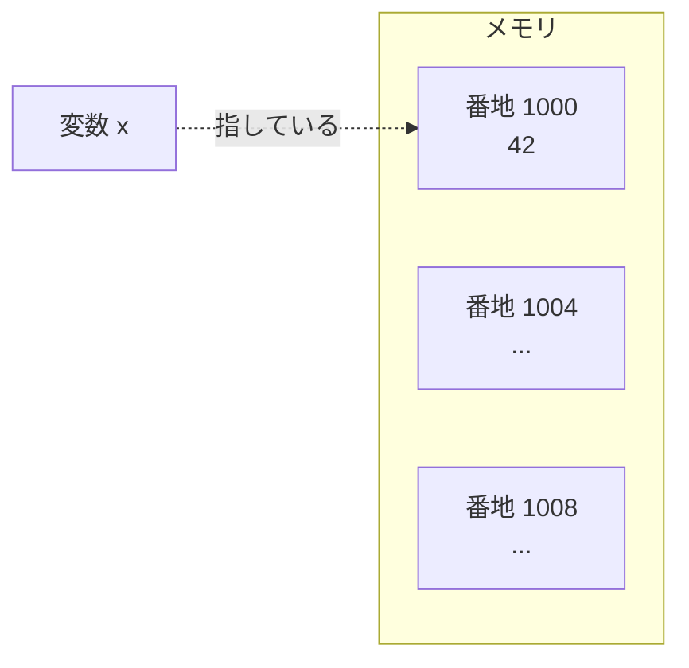

# ポインタとメモリ：値のありかを指す

ポインタはC言語でいちばん難しいと言われる概念です。しかし言語処理系を書くなら避けて通れません。構文木のノードをつなぐのも、文字列を扱うのも、関数を値として渡すのも、すべてポインタが土台になります。この章では、メモリのモデルから始めて、ポインタを「こわくない道具」にしていきます。

## メモリは巨大な番地付きの棚である

ポインタを理解する第一歩は、**メモリ（memory）**のイメージを持つことです。コンピュータのメモリは、1バイトずつ区切られた巨大な棚だと考えてください。それぞれの区画には**番地（address、アドレス）**という通し番号が振られています。0番地、1番地、2番地……と続く、ロッカーの番号のようなものです。

変数を宣言すると、その型に応じた区画がメモリ上に確保されます。`int x = 42;` と書くと、どこかの番地に4バイト分の場所が取られ、そこに `42` が書き込まれます。



**ポインタとは、この「番地」を値として持つ変数**です。普通の変数が「数値そのもの」を持つのに対し、ポインタは「値がどこにあるか（番地）」を持ちます。住所を書いたメモのようなものだと考えるとよいでしょう。メモには家そのものは入っていませんが、それをたどれば家にたどり着けます。

## アドレス演算子と間接参照演算子

ポインタを扱う基本の道具は二つです。**アドレス演算子 `&`** と、**間接参照演算子 `*`** です。

```c
#include <stdio.h>

int main(void) {
    int x = 42;
    int *p = &x;     // p は「x の番地」を持つポインタ

    printf("x の値   : %d\n", x);    // 42
    printf("x の番地 : %p\n", (void *)p);  // 例: 0x7ffd...
    printf("p の指す先: %d\n", *p);  // 42（p をたどって読む）

    *p = 100;        // p の指す先（＝x）に 100 を書く
    printf("x の値   : %d\n", x);    // 100 に変わっている

    return 0;
}
```

一つずつ読み解きましょう。`int *p` は「`p` は `int` を指すポインタだ」という宣言です。型の `int` に `*` を付けると「それを指すポインタ型」になります。`&x` は「`x` の番地」を取り出す式で、これを `p` に入れています。

`*p` は「`p` が指す先の値」を表します。これを**間接参照（dereference）**と呼びます。`*p` は読み出しにも書き込みにも使えて、`*p = 100;` と書くと `p` が指す場所（つまり `x`）に `100` が書き込まれます。`p` 自身は番地を持ったままで、その**指す先を通して** `x` を書き換えているのです。

> [!NOTE]
> `*` という記号は、宣言（`int *p`）と式（`*p`）で見た目が同じですが、役割が違います。宣言の `*` は「ポインタ型である」という印、式の `*` は「指す先をたどる」という操作です。最初は紛らわしいですが、文脈で読み分けます。

## なぜポインタが必要なのか

「値そのものを使えばいいのに、なぜわざわざ番地を介すのか」と思うかもしれません。言語処理系づくりの観点から、ポインタが要る理由は大きく三つあります。

**第一に、関数に変更を持ち帰らせるため**です。Cでは、関数に値を渡すとその**コピー**が渡されます（**値渡し**）。だから関数の中で引数を書き換えても、呼び出し元の変数は変わりません。呼び出し元の変数そのものを書き換えてほしいときは、その番地（ポインタ）を渡します。

```c
void increment(int *n) {
    *n = *n + 1;     // 指す先を書き換える
}

int main(void) {
    int count = 5;
    increment(&count);   // count の番地を渡す
    // count はここで 6 になっている
    return 0;
}
```

**第二に、大きなデータを安く渡すため**です。構文木のノードのように大きな構造体を関数に渡すたびにコピーしていては、時間もメモリも無駄になります。番地（多くの環境で8バイト）だけを渡せば、中身はコピーせず共有できます。

**第三に、データ構造を組み立てるため**です。木やリストのように「あるノードが別のノードを指す」構造は、ポインタなしには作れません。これは後の章で構文木を作るときの核心になります[](#cite:appel1998)。

## ヌルポインタ：どこも指していない印

ポインタは「どこも指していない」状態を表せます。それが**ヌルポインタ（null pointer）**で、`NULL` という名前で書きます（`<stddef.h>` などで定義されています）。

```c
int *p = NULL;     // いまは何も指していない

if (p != NULL) {
    printf("%d\n", *p);   // 指す先があるときだけ読む
}
```

ヌルポインタは「まだ値がない」「探したが見つからなかった」といった状況を表すのに使います。たとえば「シンボルテーブルから変数を探したが未定義だった」ときに `NULL` を返す、という設計はよくあります。

> [!CAUTION]
> ヌルポインタを間接参照する（`*p` で `NULL` をたどる）と、プログラムは異常終了します（多くの環境で「セグメンテーション違反 / Segmentation fault」というエラーになります）。ポインタをたどる前に `NULL` でないかを確かめるのは、安全なCプログラムの基本です[](#cite:seacord2020)。

## 配列とポインタ：地続きの関係

**配列（array）**は、同じ型の値をメモリ上に連続して並べたものです。

```c
int nums[5] = {10, 20, 30, 40, 50};
printf("%d\n", nums[2]);   // 30（添字は 0 から数える）
```

`nums[2]` の `[2]` が**添字（index）**で、先頭を `0` として数えます。だから3番目の要素は `nums[2]` です。

Cでは配列とポインタが深く結びついています。配列の名前は、多くの場面で**先頭要素の番地**として振る舞います。そのため `nums[i]` は、内部的には「先頭の番地から `i` 個分ずらした場所をたどる」という計算になっています。この「番地をずらす」計算を**ポインタ演算（pointer arithmetic）**と呼びます。

```c
int *p = nums;       // 配列名は先頭の番地。p は nums[0] を指す
printf("%d\n", *p);       // 10
printf("%d\n", *(p + 2)); // 30 … nums[2] と同じ意味
```

`p + 2` は「2バイト先」ではなく「`int` 2個分先」を指します。ポインタ演算は型の幅を考慮してくれるのです。この性質は、字句解析で文字列を1文字ずつ読み進めるときなどに自然に使われます。

> [!WARNING]
> 配列の範囲外をアクセスしてもCは止めてくれません。`nums[5]` や `nums[100]`（要素数5の配列に対して）を読み書きすると、関係ないメモリを壊し、原因のわかりにくいバグになります。これを**バッファオーバーフロー**と呼び、深刻な不具合やセキュリティ問題の原因になります。添字が範囲内かは自分で管理する必要があります。

## 文字列はchar の配列である

Cには専用の「文字列型」がありません。**文字列は `char` の配列**として表され、末尾に `'\0'`（**ヌル文字**、値が0の文字）を置いて「ここで終わり」を示します。

```c
char word[] = "let";   // 'l' 'e' 't' '\0' の4バイトが並ぶ
```

`"let"` と書くと文字3個に見えますが、終端の `'\0'` を含めてメモリ上は4バイトです。文字列を扱う関数（`strlen` で長さを測る、`strcmp` で比較する、など）は、この `'\0'` を目印に文字列の終わりを判断します。言語処理系の字句解析では、ソースコードをこの「char の並び」として受け取り、先頭からポインタで読み進めていきます。

## 言語処理系での使いどころ：トークンを読み進める

ここまでの道具を組み合わせると、字句解析の最初の一歩が書けます。次の関数は、文字列の中の空白を読み飛ばし、最初の非空白文字を指すポインタを返します。

```c
#include <stdio.h>

// p が指す位置から空白を飛ばし、次の文字の位置を返す
const char *skip_spaces(const char *p) {
    while (*p == ' ' || *p == '\t') {
        p++;            // ポインタを1文字進める
    }
    return p;
}

int main(void) {
    const char *src = "   1 + 2";
    const char *p = skip_spaces(src);
    printf("最初の文字は '%c'\n", *p);   // '1'
    return 0;
}
```

`while (*p == ' ' || ...)` は「`p` が指す文字が空白である間」くり返す、という意味です。`p++` でポインタを1文字進め、空白でない文字に出会ったらループを抜けます。最後に、その位置を指すポインタを返します。ソースコード全体を先頭から終端までこうやって舐めていくのが、字句解析の骨組みです[](#cite:nystrom2021)。`const` という見慣れない語が付いていますが、これは「指す先を書き換えない」という約束で、専用の章（[](const.md)）で詳しく扱います。

## この章のまとめ

- メモリは番地付きの棚であり、ポインタはその番地を値として持つ。
- `&` で番地を取り、`*` で指す先をたどる（間接参照）。
- ポインタは「関数に変更を持ち帰らせる」「大きなデータを安く渡す」「データ構造を組む」ために要る。
- どこも指さないポインタは `NULL`。たどる前に確認する。
- 配列とポインタは地続きで、添字アクセスはポインタ演算で説明できる。範囲外アクセスに注意。
- 文字列は `'\0'` 終端の `char` 配列。字句解析はこれをポインタで読み進める。

ポインタを手にしたことで、次の部では複雑なデータ構造——構文木や値の表現——を組み立てられるようになります。
