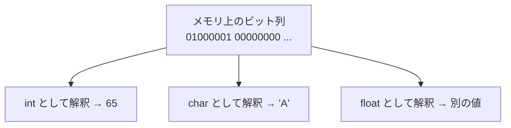

# 型とtypedef：値の正体を決める

前章で「変数には型がある」と述べました。型はC言語の根幹であり、言語処理系を書くときには「処理系自身を実装するための型」と「処理系が扱う言語の型」の二つを同時に考えることになります。この章では、Cの型の正体を掘り下げ、型に別名を付ける `typedef` の使いどころまで進みます。

## 型とは「ビットの解釈の仕方」である

コンピュータのメモリに入っているのは、突き詰めれば `0` と `1` の並び——**ビット（bit）**の列だけです。同じビット列でも、それを「整数」と思って読むか「小数」と思って読むかで、意味はまったく変わります。**型とは、そのビット列をどう解釈し、どれだけの幅（バイト数）を占め、どんな演算ができるかを決める情報**です。

たとえば32個のビット列 `01000001...` は、整数として読めばある数値ですが、文字として読めば `'A'` かもしれません。型がこの解釈を確定させます。だからこそCは、変数を宣言するときに型を要求するのです。この「ビットの解釈」という見方は、後で共用体（[](union.md)）を理解するときの鍵になります。



## 整数型と、その幅

Cの整数型は一種類ではありません。表せる値の範囲（＝占めるビット数）によって、いくつかの型があります。

| 型 | おおよその幅 | 用途の目安 |
|----|------------|-----------|
| `char` | 1バイト（8ビット） | 文字、または小さな整数・バイト列 |
| `short` | 2バイト | 小さめの整数 |
| `int` | 4バイト（多くの環境） | ふつうの整数。基本はこれ |
| `long` | 4または8バイト | 大きめの整数 |
| `long long` | 8バイト | とても大きな整数 |

ここで「おおよそ」と書いたのには理由があります。**Cの規格は、各型の正確なバイト数を固定していません**[](#cite:iso2018)。「`int` は `short` 以上、`long` は `int` 以上」といった大小関係は決まっていますが、具体的な幅は環境（CPUやコンパイラ）に委ねられています。手元の環境での実際の幅は `sizeof` 演算子で調べられます。

```c
#include <stdio.h>

int main(void) {
    printf("int は %zu バイト\n", sizeof(int));
    printf("long は %zu バイト\n", sizeof(long));
    return 0;
}
```

`sizeof(型)` はその型が占めるバイト数を返します。`printf` の `%zu` は `sizeof` が返す型（`size_t` という符号なし整数型）を表示するための書式です。

> [!WARNING]
> 「`int` は必ず4バイト」と思い込むと、別の環境に移したときに動かなくなることがあります。言語処理系のように長く使われ、いろいろな環境で動かしたいソフトウェアでは、この**移植性（portability）**の問題が現実になります。次節の固定幅整数型がその対策です。

## 符号の有無と固定幅整数型

整数型には、負の数を表せる**符号付き（signed）**と、0以上の数しか表せないかわりに正の方向へ倍まで表せる**符号なし（unsigned）**の区別があります。`unsigned int` のように `unsigned` を付けると符号なしになります。バイト列の長さ（バイナリのサイズ）や文字コードなど、負にならない量を扱うときは符号なしが自然です。

幅が環境依存だと困る場面のために、Cは**幅を名前で固定した整数型**を用意しています。`<stdint.h>` を include すると使えます。

```c
#include <stdint.h>

int32_t  token_id;   // ちょうど32ビットの符号付き整数
uint8_t  byte;       // ちょうど8ビットの符号なし整数（バイト1個）
int64_t  big_value;  // ちょうど64ビットの符号付き整数
```

`int32_t` なら、どの環境でも必ず32ビットです。言語処理系では「バイトコードの1命令を `uint8_t` で表す」「整数値を `int64_t` で持つ」のように、幅をきっちり決めたい場面が多く、これらの型が活躍します[](#cite:nystrom2021)。

> [!CAUTION]
> 符号なし整数の引き算には落とし穴があります。`unsigned int a = 0;` のとき `a - 1` は「−1」にはならず、表せる最大値（環境により約42億）に**回り込み（ラップアラウンド）**ます。配列の添字計算などでこれを踏むと、見つけにくいバグになります。引き算が負になりうるなら符号付きを使いましょう。

## 浮動小数点型と文字

小数を扱うには**浮動小数点型**を使います。`float`（単精度、約4バイト）と `double`（倍精度、約8バイト）があり、精度が必要なら `double` を使うのが無難です。浮動小数点数は「だいたいの値」を表すもので、`0.1 + 0.2` がちょうど `0.3` にならないなど、誤差が出ます。言語処理系で小数リテラルを実装するときは、この誤差の存在を前提に設計します。

文字は前章で触れたとおり `char` で表します。Cの世界では、`char` は実は**小さな整数**でもあります。`'A'` は文字コード（多くの環境ではASCIIの65）という整数として扱われ、`'A' + 1` は `'B'` の文字コードになります。字句解析で「この文字は数字か？」を `c >= '0' && c <= '9'` のように判定できるのは、文字が整数だからです。

## 型変換：暗黙と明示

異なる型の値が混ざった式では、型の**変換（conversion）**が起こります。Cはしばしば自動で変換します。これを**暗黙の型変換（implicit conversion）**と呼びます。たとえば `int` と `double` を足すと、`int` のほうが `double` に変換されてから計算されます。

自分の意思で変換するときは、**キャスト（cast）**と呼ぶ書き方を使います。

```c
int   a = 7;
int   b = 2;
double result = (double)a / b;   // a を double に変換してから割る → 3.5
```

`(double)a` が「`a` を `double` として扱え」という明示の変換です。これがないと `a / b` は整数の割り算になって `3` に切り捨てられ、その後 `double` にしても `3.0` のままです。前章で触れた `/` の落とし穴は、こうしたキャストで回避できます。

> [!NOTE]
> 暗黙の変換は便利な反面、意図しない情報の欠落を招くことがあります。`double` を `int` に代入すると小数点以下が捨てられます。コンパイラの `-Wconversion` 警告を使うと、危ない変換を知らせてくれます。本書の方針どおり、警告は積極的に拾って消していきましょう。

## typedef：型に別名を付ける

ここからが言語処理系づくりで効いてくる話です。`typedef` は、既存の型に**別名（alias）**を付ける機能です。

```c
typedef int64_t Value;   // 「Value」は int64_t の別名になる

Value x = 100;           // int64_t x = 100; と同じ意味
```

なぜ別名が役立つのでしょうか。第一に、**意図が名前で伝わる**からです。`int64_t result` と書くより `Value result`（処理系が扱う値だ）と書くほうが、コードを読む人に役割が伝わります。

第二に、**後から変えやすい**ことです。いま値を `int64_t` で表していても、将来「小数も扱いたい」と思うかもしれません。コード中のあちこちに `int64_t` と直書きしていると全部を直す羽目になりますが、`typedef int64_t Value;` の一行だけにまとめておけば、その一行を `typedef double Value;` に変えるだけで済みます。この「一箇所で型を切り替えられる」性質は、設計を試行錯誤する言語処理系づくりと相性が良いのです[](#cite:appel1998)。

`typedef` の本当の威力は、構造体（[](struct.md)）や共用体（[](union.md)）、関数ポインタ（[](function-pointers.md)）のような、書くと長くなる型に短い名前を付けられる点にあります。これらの章で `typedef` が繰り返し登場します。

```c
// 先取り：構造体に別名を付けると、こう短く書ける
typedef struct Token Token;
Token t;   // struct Token t; と書かずに済む
```

> [!TIP]
> `typedef` は新しい型を作るわけではありません。あくまで既存の型の**あだ名**です。`typedef int Meters; typedef int Seconds;` としても、`Meters` と `Seconds` は中身が同じ `int` なので、取り違えてもコンパイラは怒りません。型による厳密な区別がほしい場合は、後の章で扱う構造体で包む手があります。

## この章のまとめ

- 型とは「ビット列をどう解釈し、どれだけの幅を取り、何ができるか」を決める情報。
- 整数型の幅は環境依存。移植性が要るなら `int32_t` などの固定幅整数型を使う。
- 符号なし整数の回り込みや、整数除算の切り捨てに注意する。
- 型変換には暗黙のものと明示（キャスト）のものがある。警告を活用する。
- `typedef` は型に別名を付け、意図を伝え、後からの差し替えを容易にする。

次章では、いよいよC言語最大の山場である**ポインタ**に挑みます。型の話がここでも土台になります。
