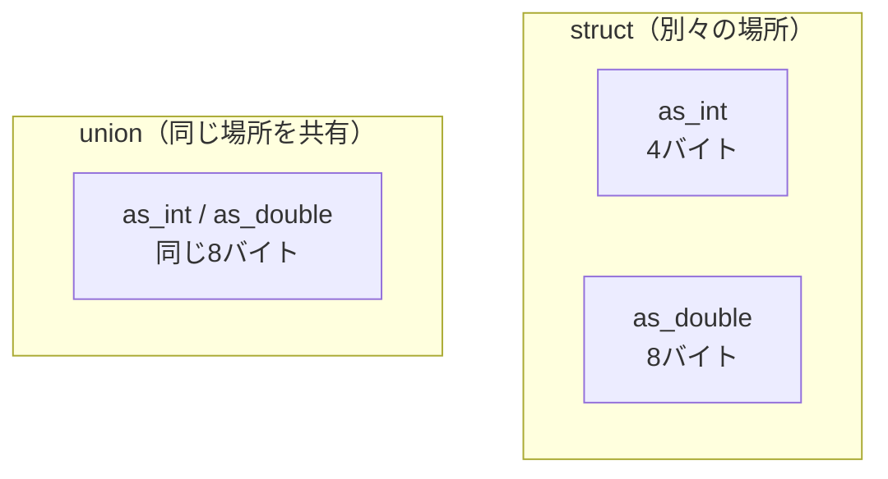

# 共用体：同じ場所を使い分ける

前章の構文木ノードには、少しもったいない点がありました。数値の葉ノードは `value` しか使わず `left`／`right` は無駄になり、演算ノードは逆に `value` を使いません。「種類によって必要なメンバが違う」——この状況をきれいに表すのが**共用体（union）**です。共用体は言語処理系で「値」や「ノード」を表現するときの定番道具で、この章はその使いこなしが主題です。

## 共用体とは：メンバが場所を共有する

構造体は、すべてのメンバがそれぞれ別の場所を占めました。**共用体は、すべてのメンバが同じ場所を共有します**。

```c
union Number {
    int    as_int;      // 整数として見たときの値
    double as_double;   // 小数として見たときの値
};
```

見た目は構造体（`struct`）とそっくりで、`struct` を `union` に変えただけです。しかし意味はまったく違います。`union Number` のサイズは、`as_int`（4バイト）と `as_double`（8バイト）の**合計**ではなく、いちばん大きいメンバに合わせた**8バイト**です。`as_int` と `as_double` は、その同じ8バイトを重ねて使います。



これは[](types.md)で述べた「型とはビットの解釈の仕方」という話と直結します。共用体は、**同じビット列を、どのメンバの型として解釈するかを選べる**仕組みなのです。

```c
union Number n;
n.as_int = 65;
printf("%d\n", n.as_int);   // 65
```

## 危険な性質：書いたのと違うメンバを読むと

共用体には、知らずに使うと痛い目を見る性質があります。**あるメンバに書き込んだあと、別のメンバから読むと、結果は意味をなしません**。

```c
union Number n;
n.as_double = 3.14;
printf("%d\n", n.as_int);   // 3 ではなく、ビットを int と誤解した謎の値
```

`as_double` として書いた `3.14` のビット列を、`as_int` として読み解いてしまうので、出てくるのはでたらめな整数です。共用体は「いま、どのメンバとして使っているか」を**自分で覚えておかなければならない**のです。共用体自身はそれを記録してくれません。

> [!CAUTION]
> 「最後にどのメンバに書いたか」を取り違えて読むのは、共用体にまつわる典型的なバグです。Cの規格上も、別メンバとして読む動作の多くは安全が保証されていません[](#cite:iso2018)。この問題への答えが、次に説明する「タグ付き共用体」です。共用体は単独で使うより、常に「種類を覚えるための印」とセットで使う、と心得てください。

## タグ付き共用体：種類の印を添える

解決策はシンプルです。共用体と一緒に、「いまどの種類か」を表す**タグ（tag）**を構造体に同居させます。これを**タグ付き共用体（tagged union）**と呼びます。言語処理系で「いろいろな種類の値」を一つの型で表すときの、ほぼ標準的なやり方です。

実行時の値が「整数」か「小数」か「真偽値」のいずれかを取る言語を考えましょう。

```c
typedef enum {
    VAL_INT,
    VAL_DOUBLE,
    VAL_BOOL,
} ValueType;

typedef struct {
    ValueType type;          // タグ：いまどの種類か
    union {
        int64_t as_int;      // type == VAL_INT のとき有効
        double  as_double;   // type == VAL_DOUBLE のとき有効
        int     as_bool;     // type == VAL_BOOL のとき有効
    } u;                     // 種類ごとの中身（場所を共有）
} Value;
```

新顔の `enum`（**列挙型 / enumeration**）は、名前付きの整数定数をまとめて定義する仕組みです。ここでは `VAL_INT` が `0`、`VAL_DOUBLE` が `1`、`VAL_BOOL` が `2` という整数に自動で割り当てられます。数字を直接書くより、`VAL_INT` という名前で書いたほうが意図が明確で、間違いも減ります。これがタグの正体です。

構造体 `Value` は、タグ `type` と、種類ごとの中身を入れる共用体 `u` の二つを持ちます。「`type` を見れば、`u` のどのメンバが有効かがわかる」という約束で運用します。`int64_t` は[](types.md)で学んだ固定幅整数型です。

## タグ付き共用体を安全に使う

タグ付き共用体は、「作るときにタグも一緒に立てる」「使うときはタグを見てから対応するメンバを読む」という二つの規律で安全に使えます。値を作る関数を用意しましょう。

```c
Value make_int(int64_t x) {
    Value v;
    v.type = VAL_INT;       // タグを立て、
    v.u.as_int = x;         // 対応するメンバに書く
    return v;
}

Value make_double(double x) {
    Value v;
    v.type = VAL_DOUBLE;
    v.u.as_double = x;
    return v;
}

Value make_bool(int b) {
    Value v;
    v.type = VAL_BOOL;
    v.u.as_bool = b;
    return v;
}
```

タグの設定とメンバへの書き込みを必ずセットで行うのがコツです。これらの関数を窓口にすれば、「タグだけ立てて中身を入れ忘れる」事故を防げます。

使う側では、タグで分岐してから読みます。値を画面に表示する関数を書いてみます。

```c
#include <stdio.h>
#include <stdbool.h>   // bool 型を使うため

void print_value(Value v) {
    switch (v.type) {
        case VAL_INT:
            printf("%lld\n", (long long)v.u.as_int);
            break;
        case VAL_DOUBLE:
            printf("%g\n", v.u.as_double);
            break;
        case VAL_BOOL:
            printf("%s\n", v.u.as_bool ? "true" : "false");
            break;
    }
}
```

`switch (v.type)` でタグを調べ、その種類に対応するメンバだけを読んでいます。`VAL_INT` の枝では `as_int` しか触りません。こうすれば「書いたのと違うメンバを読む」事故は起きません。各 `case` の末尾の `break` は「ここで `switch` を抜ける」という意味で、これを忘れると次の `case` まで実行が流れ落ちてしまうので注意してください。

> [!TIP]
> `switch` で `enum` を分岐するとき、`default:` をあえて書かずに全種類を `case` で並べると、後で種類を増やしたときにコンパイラが「`VAL_NIL` の場合が抜けているよ」と警告してくれることがあります（`-Wswitch` 系の警告）。本書の方針どおり警告を活用するなら、これは種類の数え漏れを見つける良い仕掛けになります。

## なぜタグ付き共用体が言語処理系に効くのか

タグ付き共用体は、言語処理系のあらゆる場所に現れます。代表的なのは次の二つです。

ひとつは、いま見た**実行時の値（runtime value）の表現**です。動的に型が決まる言語では、変数に入る値が整数か文字列かオブジェクトか、実行してみないとわかりません。一つの `Value` 型でそれらすべてを表すために、タグ付き共用体がうってつけなのです[](#cite:nystrom2021)。

もうひとつは、**構文木ノードの表現**です。前章の `Node` は数値ノードと演算ノードを同じ構造体で表し、未使用のメンバが無駄になっていました。タグ付き共用体を使えば、ノードの種類ごとに必要なメンバだけを持たせ、メモリの無駄をなくせます。

```c
typedef enum { ND_NUM, ND_BINARY } NodeKind;

typedef struct Node {
    NodeKind kind;
    union {
        int64_t value;                  // ND_NUM のとき
        struct {                        // ND_BINARY のとき
            int op;
            struct Node *left;
            struct Node *right;
        } binary;
    } u;
} Node;
```

数値ノードは `u.value` だけを、演算ノードは `u.binary` 一式だけを使います。共用体のおかげで、両者は同じ場所を共有し、ノード1個のサイズは「いちばん大きい種類」に抑えられます。コンパイラの教科書でも、構文木をこの形（種類タグ＋共用体）で表す例が数多く紹介されています[](#cite:appel1998)。

## 値を使ってインタプリタを育てる

前章のインタプリタは整数しか返せませんでした。`Value` を返すようにすれば、整数と小数が混ざった計算もできます。考え方の要点だけ示します。

```c
Value eval(const Node *n) {
    if (n->kind == ND_NUM) {
        return make_int(n->u.value);
    }
    Value l = eval(n->u.binary.left);
    Value r = eval(n->u.binary.right);
    // ここで l と r のタグを見て、整数同士なら整数演算、
    // 片方でも小数なら小数演算、と振り分ける（前章 basics.md の型変換の話が効いてくる）
    if (l.type == VAL_INT && r.type == VAL_INT) {
        switch (n->u.binary.op) {
            case '+': return make_int(l.u.as_int + r.u.as_int);
            /* 他の演算子も同様 */
        }
    }
    /* 小数が絡む場合の処理は省略 */
    return make_int(0);
}
```

左右の子の**タグを見て**、整数同士か、小数が絡むかを判断し、適切な演算を選びます。これはまさに、動的型付き言語のインタプリタが実行時に行っている判断そのものです。「タグを見て分岐する」というこのパターンが、処理系のあちこちで繰り返されることになります。

> [!NOTE]
> このタグ分岐は柔軟な反面、実行のたびにコストがかかります。あらゆる演算の前に「これは何型か？」を確かめるからです。このコストをどう減らすかは、性能を追い求めるインタプリタの中心的な課題で、[](optimization-advanced.md)で再び取り上げます。

## この章のまとめ

- 共用体はすべてのメンバが同じメモリを共有し、サイズは最大メンバに合わせる。
- 「書いたのと違うメンバを読む」と結果は無意味。共用体は単独では危険。
- タグ（多くは `enum`）を添えた**タグ付き共用体**にすれば安全に使い分けられる。
- 作るときにタグを立て、使うときはタグで分岐してから読む、という規律を守る。
- 実行時の値と構文木ノードの表現は、どちらもタグ付き共用体の代表的な使いどころ。

次章では、関数そのものをデータとして扱う**関数ポインタ**に進みます。タグで分岐するかわりに「関数の表」を引く、という別の設計が見えてきます。
